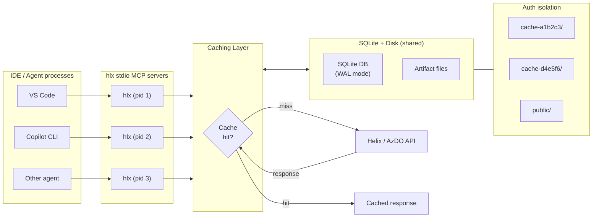

# helix.mcp

An increasingly inaccurately named [CLI](docs/cli-reference.md) and [MCP](https://github.com/lewing/helix.mcp/blob/main/README.md#mcp-tools) server for AI agents investigating .NET CI/CD failures across [Helix](https://helix.dot.net) and [Azure DevOps](https://dev.azure.com).

Built with [Squad](https://github.com/bradygaster/squad) — [meet the squad](.ai-team/SQUAD.md).

## Why?

AI agents investigating CI failures in dotnet repos (runtime, sdk, aspnetcore, etc.) hit two problems:

1. **Raw APIs return too much data.** A single Helix console log can be megabytes. The Azure DevOps build timeline returns hundreds of records. Dumping this into a context window wastes tokens and drowns the signal.
2. **Every agent starts from scratch.** When multiple agents — or the same agent across tool calls — inspect the same build, each one repeats the same API calls and downloads.

hlx solves both:

- **Return less, return better.** Tools like `helix_search_log` and `azdo_search_log` search in place and return only matching lines with context — agents never download a full log. `helix_status` returns structured failure summaries instead of raw JSON. Default `tail` limits (500 lines), `filter` parameters (`failed` by default), and `maxMatches` caps keep responses focused.
- **Cache everything, share across processes.** A local SQLite cache sits between agents and the APIs. Different MCP server instances (one per IDE window/terminal) share the same cache, so the second agent to inspect a job gets instant results. Smart TTLs track job lifecycle — running jobs cache briefly (15–30s), completed jobs cache for hours.

> **Zero config** — public dotnet CI works out of the box. Install and go.

## Context-Efficient Design

Every tool is designed to minimize token consumption in agent context windows:

| Technique | How it helps |
|-----------|-------------|
| **Tail limits** | `helix_logs` and `azdo_log` return the last N lines (default 500), not the full log |
| **Pattern search** | `helix_search_log` and `azdo_search_log` search outside agent context and return matching lines with configurable context — no full ingestion |
| **Failure-first defaults** | `helix_status`, `azdo_timeline`, `azdo_test_results` default to showing only failures |
| **Structured JSON** | Failure summaries, test results, and timeline data come pre-parsed — no agent-side text extraction |
| **Batch operations** | `helix_batch_status` checks up to 50 jobs in one call; `helix_find_files` scans N work items instead of N+1 API calls |
| **Ranked search** | `azdo_search_log` can search all build logs, ranking by failure likelihood and stopping early when `maxMatches` is reached |
| **Idempotent annotations** | Read-only tools marked safe for retry and caching — clients can optimize scheduling and error recovery |

## Investigation Path

- When repo workflows vary, start with `helix_ci_guide(repo)` for the repo-specific path and search patterns.
- Use `helix_parse_uploaded_trx` only when the work item uploads structured test results to Helix (runtime CoreCLR, XHarness device tests).
- Otherwise use `azdo_test_runs` → `azdo_test_results` for structured results, or `helix_search_log` when the signal is in console output.

## Cross-Process Caching



- **SQLite WAL mode** — multiple processes read/write the same DB safely with busy timeout
- **Smart TTLs** — running jobs: 15–30s, completed jobs: 1–4h, console logs for running jobs: never cached. AzDO in-progress builds use dual-key freshness with incremental log fetching (delta-append)
- **Auth-isolated storage** — each unique token gets its own cache directory (`cache-{hash}/`). Unauthenticated requests use `public/`. No cross-token leakage
- **LRU eviction** — 1 GB cap (configurable via `HLX_CACHE_MAX_SIZE_MB`), artifact files expire after 7 days without access

| Setting | Default | Env var |
|---------|---------|---------|
| Max cache size | 1 GB | `HLX_CACHE_MAX_SIZE_MB` (set to `0` to disable) |
| Cache location (Windows) | `%LOCALAPPDATA%\hlx\` | — |
| Cache location (Linux/macOS) | `$XDG_CACHE_HOME/hlx/` | — |

```bash
hlx cache status   # Show cache size, entry count, oldest/newest entries
hlx cache clear    # Wipe all cached data
```

## MCP Tools

### Helix Tools (9)

| Tool | Description |
|------|-------------|
| `helix_status` | Job pass/fail summary with failure categorization. Filter: `failed` (default), `passed`, `all`. |
| `helix_batch_status` | Status for up to 50 jobs at once with aggregate totals. |
| `helix_logs` | Console log content (last N lines, default 500). |
| `helix_search_log` | Search a console log or uploaded file for repo-specific failure patterns without downloading the full content. |
| `helix_files` | List uploaded files for a work item, grouped by type. |
| `helix_find_files` | Search across work items for files matching a glob (`*.binlog`, `*.trx`, `*.dmp`). |
| `helix_work_item` | Detailed work item info (exit code, state, machine, duration, failure category). |
| `helix_download` | Download files from a work item or direct blob URL. Supports glob patterns for work-item downloads. |
| `helix_parse_uploaded_trx` | Parse TRX/xUnit XML files uploaded to Helix blob storage into test names, outcomes, and error messages. |

### AzDO Tools (11)

| Tool | Description |
|------|-------------|
| `azdo_build` | Build details (status, result, branch, timing, URL). Accepts URLs or integer IDs. |
| `azdo_builds` | List recent builds. Filter by branch, PR, definition, status. |
| `azdo_timeline` | Build timeline (stages, jobs, tasks). Filter: `failed` (default) or `all`. |
| `azdo_log` | Log content for a specific build step (last N lines, default 500). |
| `azdo_search_log` | Search a specific build log or all ranked build logs for a pattern with context lines. |
| `azdo_search_timeline` | Search timeline records by name or issue pattern. |
| `azdo_changes` | Commits/changes associated with a build. |
| `azdo_test_runs` | Test run summaries (total, passed, failed counts). |
| `azdo_test_results` | Individual test results. Defaults to failed tests only (top 200). |
| `azdo_artifacts` | Build artifacts with pattern filtering (e.g., `*.binlog`). |
| `azdo_test_attachments` | Test result attachments (screenshots, logs, dumps). |

## MCP Resources

MCP resources are URI-addressable data that clients can discover and read without invoking a tool.

| Resource URI | Description |
|-------------|-------------|
| `ci://profiles` | Overview of CI investigation patterns for all .NET repositories. |
| `ci://profiles/{repo}` | CI investigation guide for a specific .NET repository (e.g., `ci://profiles/runtime`). |

These provide the same CI investigation guides available via the `helix_ci_guide` tool, exposed as client-discoverable resources for browsing and caching.

## Installation

### Use with the dotnet-dnceng plugin (recommended)

The [dotnet-dnceng plugin](https://github.com/lewing/agent-plugins/tree/main/plugins/dotnet-dnceng) bundles hlx alongside related MCP servers (Azure DevOps, Maestro, binlog) and CI analysis skills — one install, batteries included:

```bash
copilot extensions install lewing/agent-plugins/plugins/dotnet-dnceng
```

This gives your agent `helix_*` and `azdo_*` tools plus skills for CI failure analysis, codeflow tracing, and dependency flow debugging.

### Run with dnx (no install needed)

```bash
dnx lewing.helix.mcp
```

`dnx` (new in .NET 10) auto-downloads and runs NuGet tool packages. MCP mode is the default when no subcommand is given.

### Install as global tool

```bash
dotnet tool install -g lewing.helix.mcp
```

After installation, `hlx` is available as a command. See the [CLI reference](docs/cli-reference.md) for standalone usage.

### Build from source

```bash
git clone https://github.com/lewing/helix.mcp.git
cd helix.mcp
dotnet build   # Requires .NET 10 SDK
```

> The `Microsoft.DotNet.Helix.Client` package comes from the [dotnet-eng](https://pkgs.dev.azure.com/dnceng/public/_packaging/dotnet-eng/nuget/v3/index.json) feed. The included `nuget.config` references it.

## MCP Configuration

Add to your MCP client config:

```json
{
  "servers": {
    "hlx": {
      "type": "stdio",
      "command": "dotnet",
      "args": ["dnx", "--yes", "lewing.helix.mcp"]
    }
  }
}
```

> If installed as a global tool, use `"command": "hlx"` with `"args": []` instead.

| Client | Config file | Top-level key |
|--------|------------|---------------|
| **VS Code / GitHub Copilot** | `.vscode/mcp.json` | `servers` |
| **Claude Desktop** (macOS) | `~/Library/Application Support/Claude/claude_desktop_config.json` | `mcpServers` |
| **Claude Desktop** (Windows) | `%APPDATA%\Claude\claude_desktop_config.json` | `mcpServers` |
| **Claude Code / Cursor** | `.cursor/mcp.json` | `mcpServers` |

> VS Code uses `servers`. Claude Desktop, Claude Code, and Cursor use `mcpServers` — the rest is identical.

For HTTP (remote/shared servers):

```json
{
  "servers": {
    "hlx": {
      "type": "http",
      "url": "http://localhost:3001"
    }
  }
}
```

## Authentication

### Helix

No auth needed for public Helix jobs (dotnet open-source CI). For private jobs:

```bash
hlx login          # Opens browser, prompts for token, stores via git credential
hlx auth-status    # Check current auth status
hlx logout         # Remove stored token
```

**Token resolution:** `HELIX_ACCESS_TOKEN` env var → stored credential via `git credential` → error with helpful message.

### Azure DevOps

No auth needed for public projects (e.g., `dnceng-public/public`). For private projects:

**Token resolution:** `AZDO_TOKEN` env var → Azure CLI (`az account get-access-token`) → anonymous access.

Pass tokens via MCP config:

```json
{
  "servers": {
    "hlx": {
      "type": "stdio",
      "command": "dotnet",
      "args": ["dnx", "--yes", "lewing.helix.mcp"],
      "env": {
        "HELIX_ACCESS_TOKEN": "your-helix-token",
        "AZDO_TOKEN": "your-azdo-pat"
      }
    }
  }
}
```

The HTTP MCP server supports per-request auth via `Authorization: Bearer <token>` headers, with isolated cache per client. Set `HLX_API_KEY` to gate server access.

## Security

- **Safe XML parsing** — DTD processing prohibited, XmlResolver disabled, 50 MB character limit (XXE/billion-laughs protection)
- **Path traversal protection** — all cache/download paths sanitized and validated against designated roots
- **URL scheme validation** — only HTTP/HTTPS accepted for downloads
- **File search toggle** — set `HLX_DISABLE_FILE_SEARCH=true` to disable content search tools
- **Credential storage** — tokens managed by OS keychain via `git credential`, never stored in plaintext
- **Cache sensitivity** — cached CI logs may contain secrets; treat the cache directory as sensitive. Tokens are never cached — only an irreversible 8-char hash is used for directory isolation

## Known Issues

- **File listing uses `ListFiles` endpoint** — avoids a known bug in the `Details` endpoint where file URIs are broken for subdirectories and unicode filenames ([dotnet/dnceng#6072](https://github.com/dotnet/dnceng/issues/6072)).

## Requirements

- .NET 10 SDK

## License

MIT

[](https://www.nuget.org/packages/lewing.helix.mcp)
