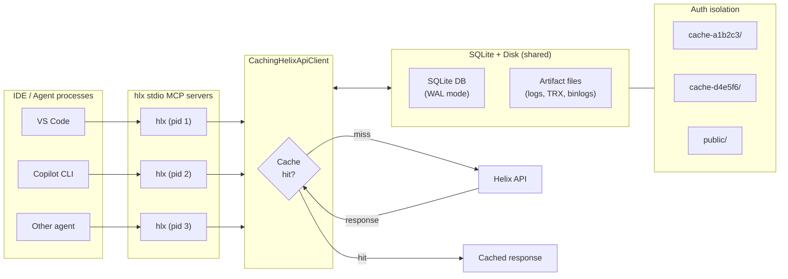

# helix.mcp — MCP server and CLI for investigating .NET CI failures (Helix + Azure DevOps)

An MCP server that exposes [.NET Helix](https://helix.dot.net) and [Azure DevOps](https://dev.azure.com) APIs as 23 structured tools with cross-process local caching — purpose-built for AI agents diagnosing CI failures in dotnet repos (runtime, sdk, aspnetcore, etc.). Also works as a standalone CLI for humans.

Built with [Squad](https://github.com/bradygaster/squad) — [meet the squad](.ai-team/SQUAD.md).

## Why hlx?

When an AI agent investigates a CI failure in a dotnet repo, it needs to inspect Helix test artifacts — console logs, TRX test results, binlogs, crash dumps. The raw Helix API returns unstructured blobs that agents must download and parse, burning context window on boilerplate extraction. If multiple agents (or the same agent across tool calls) look at the same job, each one repeats the same API calls and downloads.

hlx solves this by wrapping the Helix API as MCP tools that return structured, pre-parsed data:

- **Structured output** — `helix_status` returns categorized failure summaries as JSON; `helix_test_results` parses TRX files and returns test names, outcomes, and error messages directly. No raw text parsing needed.
- **Cross-process caching** — API responses and downloaded artifacts are cached in a local SQLite database. Different MCP server instances (one per IDE/agent) share the same cache, so the second agent to inspect a job gets instant results. TTLs are smart — running jobs cache briefly (15–30s), completed jobs cache for hours.
- **Context-efficient** — `helix_search_log`, `helix_search_file`, `azdo_search_log`, and `azdo_search_timeline` search in place and return matching lines with context, so agents never need to download a full log. `helix_find_files` locates artifacts across work items without listing every file.
- **Zero config** — public dotnet CI jobs work out of the box. Install and go.

> **ci-analysis replacement:** hlx provides 100% coverage of the Helix API surface used by the `ci-analysis` skill's ~150 lines of PowerShell, with structured caching, failure categorization, and MCP tool support on top.

## Architecture

The project is split into three layers:

- **HelixTool.Core** — Shared library containing `HelixService`, `AzdoService`, API clients, and model types. Helix API logic lives at the root; AzDO pipeline integration lives in `AzDO/`.
- **HelixTool** — CLI tool built with [ConsoleAppFramework](https://github.com/Cysharp/ConsoleAppFramework). Serves both human-readable terminal commands and a stdio MCP server (`hlx mcp`). MCP is also the default mode when no subcommand is given.
- **HelixTool.Mcp** — Standalone MCP HTTP server built with [ModelContextProtocol](https://github.com/modelcontextprotocol/csharp-sdk). Returns structured JSON for LLM agents over HTTP.

Both the CLI and MCP server depend on Core but not on each other.

## Installation

### Run with dnx (no install needed)

`dnx` (new in .NET 10) auto-downloads and runs NuGet tool packages — no install step required:

```bash
dnx lewing.helix.mcp
```

This is the recommended approach for MCP server configuration (see below). No explicit `mcp` subcommand is needed — MCP mode is the default when no command is specified.

### Install as Global Tool

```bash
dotnet tool install -g lewing.helix.mcp
```

For repo-local installation via a [tool manifest](https://learn.microsoft.com/dotnet/core/tools/local-tools-how-to-use):

```bash
dotnet new tool-manifest   # if .config/dotnet-tools.json doesn't exist
dotnet tool install --local lewing.helix.mcp
```

### Install from Local Build

```bash
dotnet pack src/HelixTool
dotnet tool install -g --add-source src/HelixTool/nupkg lewing.helix.mcp
```

After installation, `hlx` is available globally.

### Build from Source

```bash
# Prerequisites: .NET 10 SDK
git clone https://github.com/lewing/helix.mcp.git
cd helix.mcp
dotnet build
```

> **NuGet feed requirement:** The `Microsoft.DotNet.Helix.Client` SDK package is published to the
> [dotnet-eng](https://pkgs.dev.azure.com/dnceng/public/_packaging/dotnet-eng/nuget/v3/index.json)
> Azure Artifacts feed. The included `nuget.config` references this feed. If you see restore errors
> for `Microsoft.DotNet.Helix.Client`, ensure the feed is accessible.

## Quick Start

### CLI

After [installing](#installation) `lewing.helix.mcp` as a global or local tool, the `hlx` command is available:

```bash
# Authenticate (one-time setup)
hlx login

# Check a Helix job (shows failed work items by default)
hlx status 02d8bd09-9400-4e86-8d2b-7a6ca21c5009

# Show all work items including passed
hlx status 02d8bd09 all

# Download console log for a failed work item
hlx logs 02d8bd09 "dotnet-watch.Tests.dll.1"

# List uploaded files (binlogs, test results, etc.)
hlx files 02d8bd09 "dotnet-watch.Tests.dll.1"

# Download binlogs from a work item
hlx download 02d8bd09 "dotnet-watch.Tests.dll.1" --pattern "*.binlog"

# Search work items for files by pattern (e.g., binlogs, trx, dmp)
hlx find-files 02d8bd09 --pattern "*.binlog"

# Download a file by direct URL (from hlx files output)
hlx download-url "https://helix..."

# Show detailed info about a specific work item
hlx work-item 02d8bd09 "dotnet-watch.Tests.dll.1"

# Check status of multiple jobs at once
hlx batch-status 02d8bd09 a1b2c3d4

# Search console log for error patterns
hlx search-log 02d8bd09 "dotnet-watch.Tests.dll.1" "error CS"

# Search an uploaded file for a pattern
hlx search-file 02d8bd09 "dotnet-watch.Tests.dll.1" "testhost.log" "error"

# Parse TRX test results from a work item
hlx test-results 02d8bd09 "dotnet-watch.Tests.dll.1"
```

### AzDO CLI

```bash
# Get details for a specific AzDO build
hlx azdo build 12345678

# List recent builds, optionally filtered by branch
hlx azdo builds --branch main

# Show build timeline (stages, jobs, tasks)
hlx azdo timeline 12345678

# Read a specific build log (use log ID from timeline output)
hlx azdo log 12345678 42

# List commits/changes in a build
hlx azdo changes 12345678

# List test runs for a build
hlx azdo test-runs 12345678

# Get test results for a specific test run
hlx azdo test-results 12345678 98765

# Search a build log for a pattern
hlx azdo search-log 12345678 42 "error CS"

# Search ALL build logs for a pattern (ranked by failure likelihood)
hlx azdo search-log-all 12345678 --pattern "error CS"

# Search timeline records for a pattern
hlx azdo search-timeline 12345678 "test"

# List build artifacts
hlx azdo artifacts 12345678

# List attachments for a test result
hlx azdo test-attachments 98765 1234
```

Accepts bare GUIDs or full Helix URLs:
```bash
hlx status https://helix.dot.net/api/jobs/02d8bd09-9400-4e86-8d2b-7a6ca21c5009/details
```

> If running from a local build instead of the installed tool, substitute `dotnet run --project src/HelixTool --` for `hlx`.

### MCP Server

**Stdio (recommended for local use)** — launched automatically by MCP clients:

```bash
hlx mcp
```

**HTTP (for remote/shared servers)**:

```bash
# Start the HTTP MCP server (default port 5000)
dotnet run --project src/HelixTool.Mcp

# Or on a specific port
dotnet run --project src/HelixTool.Mcp --urls http://localhost:3001
```

## MCP Configuration

Add the following to your MCP client config. The `--yes` flag ensures `dnx` doesn't prompt for confirmation:

```json
{
  "servers": {
    "hlx": {
      "type": "stdio",
      "command": "dotnet",
      "args": ["dnx", "--yes", "lewing.helix.mcp"]
    }
  }
}
```

> If you've installed `lewing.helix.mcp` as a global tool, you can use `"command": "hlx"` with `"args": []` instead of `dnx`.

### Config file locations

| Client | Config file | Top-level key |
|--------|------------|---------------|
| **VS Code / GitHub Copilot** | `.vscode/mcp.json` | `servers` |
| **Claude Desktop** (macOS) | `~/Library/Application Support/Claude/claude_desktop_config.json` | `mcpServers` |
| **Claude Desktop** (Windows) | `%APPDATA%\Claude\claude_desktop_config.json` | `mcpServers` |
| **Claude Code / Cursor** | `.cursor/mcp.json` | `mcpServers` |

> **Note:** VS Code uses the `servers` key (shown above). Claude Desktop, Claude Code, and Cursor use `mcpServers` instead — the rest of the JSON is identical.

### HTTP alternative (for remote/shared servers)

```json
{
  "servers": {
    "hlx": {
      "type": "http",
      "url": "http://localhost:3001"
    }
  }
}
```

## MCP Tools

### Helix Tools

| Tool | Description |
|------|-------------|
| `helix_status` | Get work item pass/fail summary for a Helix job. Accepts a `filter` parameter: `failed` (default), `passed`, or `all`. Returns structured JSON with job metadata, failed items (with exit codes, state, duration, machine, failure category), and passed count. |
| `helix_logs` | Get console log content for a work item. Returns the log text directly (last N lines if `tail` specified, default 500). |
| `helix_files` | List uploaded files for a work item, grouped by type. Returns binlogs, testResults, and other files with names and URIs. |
| `helix_download` | Download files from a work item to a temp directory. Supports glob patterns (e.g., `*.binlog`). Returns local file paths. |
| `helix_download_url` | Download a file by direct blob storage URL (e.g., from `helix_files` output). Returns the local file path. |
| `helix_find_files` | Search work items in a job for files matching a glob pattern (`*.binlog`, `*.trx`, `*.dmp`, etc.). Returns work item names and matching file URIs. |
| `helix_work_item` | Get detailed info about a specific work item: exit code, state, machine, duration, failure category, console log URL, and uploaded files. |
| `helix_batch_status` | Get status for multiple Helix jobs at once (max 50). Accepts an array of job IDs/URLs. Returns per-job summaries, overall totals, and failure breakdown by category. |
| `helix_search_log` | Search a work item's console log for lines matching a pattern. Returns matching lines with context. Supports `contextLines` and `maxMatches` parameters. |
| `helix_search_file` | Search an uploaded file's content for lines matching a pattern — without downloading it. Supports context lines and max match limits. Disabled when `HLX_DISABLE_FILE_SEARCH=true`. |
| `helix_test_results` | Parse TRX test result files from a work item. Returns structured test results: names, outcomes, durations, and error messages/stack traces for failures. Auto-discovers `.trx` files or filter to a specific one. Disabled when `HLX_DISABLE_FILE_SEARCH=true`. |

### AzDO Tools

| Tool | Description |
|------|-------------|
| `azdo_build` | Get details of a specific Azure DevOps build. Returns build metadata including status, result, definition, source branch, timing, and web URL. Accepts a build URL or plain integer ID. |
| `azdo_builds` | List recent builds for an Azure DevOps project. Returns build summaries with status, result, branch, and timing. Filter by branch, PR number, definition ID, or status. Defaults to dnceng-public/public. |
| `azdo_timeline` | Get the build timeline showing stages, jobs, and tasks. Returns hierarchical records with state, result, timing, log references, and issues. Accepts a `filter` parameter: `failed` (default) or `all`. Use to find log IDs for `azdo_log`. |
| `azdo_log` | Get log content for a specific build log. Returns plain text (last N lines, default 500). Use after `azdo_timeline` to read the log of a failed task. |
| `azdo_changes` | Get commits/changes associated with a build. Returns commit IDs, messages, authors, and timestamps. |
| `azdo_test_runs` | List test runs for a build. Returns test run summaries with total, passed, and failed counts. Use before `azdo_test_results` to get run IDs. |
| `azdo_test_results` | Get test results for a specific test run. Returns individual test case outcomes, durations, and error details. Defaults to showing only failed tests (top 200). |
| `azdo_artifacts` | List artifacts produced by a build. Returns artifact names, resource types, and download URLs. Supports pattern filtering (e.g., `*.binlog`, `*.trx`). Default top: 50. |
| `azdo_search_log` | Search a build log for lines matching a pattern. Returns matching lines with context. Use after `azdo_timeline` to search a specific log by its log ID. Supports `contextLines` and `maxMatches` parameters. |
| `azdo_search_timeline` | Search build timeline records by name or issue message pattern. Returns matching records with timing, result, parent context, and issues. Filter by record type (`Stage`/`Job`/`Task`) and result (`failed` default, or `all`). |
| `azdo_search_log_across_steps` | Search ALL log steps in a build for lines matching a pattern. Automatically ranks logs by failure likelihood (failed tasks first, then tasks with issues, then large succeeded logs). Stops early when `maxMatches` is reached. Use instead of manually iterating `azdo_search_log` across many log IDs. |
| `azdo_test_attachments` | List attachments for a specific test result (screenshots, logs, dumps). Requires run ID and result ID from previous tool output. Default top: 50. |

## CLI Commands

| Command | Description |
|---------|-------------|
| `hlx status <jobId> [failed\|passed\|all]` | Work item summary. Filter is a positional arg (default: `failed`). |
| `hlx logs <jobId> <workItem>` | Download console log to a temp file and print the path. |
| `hlx files <jobId> <workItem>` | List uploaded files for a work item. |
| `hlx download <jobId> <workItem> [--pattern PAT]` | Download work item files. Glob pattern (default: `*`). |
| `hlx download-url <url>` | Download a file by direct blob storage URL. |
| `hlx find-files <jobId> [--pattern PAT] [--max-items N]` | Search work items for files matching a glob pattern. |
| `hlx work-item <jobId> <workItem>` | Detailed work item info (exit code, state, machine, files). |
| `hlx batch-status <jobId1> <jobId2> ...` | Status for multiple jobs in parallel. |
| `hlx search-log <jobId> <workItem> <pattern> [--context N] [--max-matches N]` | Search console log for a pattern. |
| `hlx search-file <jobId> <workItem> <fileName> <pattern> [--context N] [--max-matches N]` | Search an uploaded file for a pattern. |
| `hlx test-results <jobId> <workItem> [--file-name NAME] [--include-passed] [--max-results N]` | Parse TRX test results from a work item. |
| `hlx login [--no-browser]` | Authenticate with helix.dot.net (opens browser, prompts for token, stores via git credential). |
| `hlx logout` | Remove stored authentication token. |
| `hlx auth-status` | Show current authentication status and test connectivity. |
| `hlx cache status` | Show cache size, entry count, oldest/newest entries. |
| `hlx cache clear` | Wipe all cached data (all auth contexts). |
| `hlx mcp` | Start MCP server over stdio. Also the default when no command is given. |
| `hlx llms-txt` | Print CLI documentation for LLM agents (tool descriptions, parameters, usage). |

### AzDO CLI Commands

| Command | Description |
|---------|-------------|
| `hlx azdo build <buildId>` | Get details of a specific AzDO build (status, result, branch, timing, URL). |
| `hlx azdo builds [--branch B] [--pr N] [--definition-id D] [--status S] [--top N]` | List recent builds for a project. Defaults to dnceng-public/public. |
| `hlx azdo timeline <buildId> [--filter failed\|all]` | Show build timeline (stages, jobs, tasks). Default filter: `failed`. |
| `hlx azdo log <buildId> <logId> [--tail-lines N]` | Get log content for a build log entry. Default tail: 500 lines. |
| `hlx azdo changes <buildId> [--top N]` | List commits/changes associated with a build. |
| `hlx azdo test-runs <buildId> [--top N]` | List test runs for a build (total, passed, failed counts). |
| `hlx azdo test-results <buildId> <runId> [--top N]` | Get test results for a specific test run. Defaults to failed tests (top 200). |
| `hlx azdo artifacts <buildId> [--pattern PAT] [--top N]` | List build artifacts. Supports glob-style filtering (e.g., `*.binlog`). |
| `hlx azdo search-log <buildId> <logId> <pattern> [--context-lines N] [--max-matches N]` | Search a build log for a pattern. |
| `hlx azdo search-log-all <buildId> [--pattern P] [--context-lines N] [--max-matches N] [--max-logs N] [--min-lines N]` | Search all build log steps for a pattern, ranked by failure priority. |
| `hlx azdo search-timeline <buildId> <pattern> [--type Stage\|Job\|Task] [--result failed\|all]` | Search timeline records by name or issue pattern. |
| `hlx azdo test-attachments <runId> <resultId> [--top N]` | List attachments for a test result (screenshots, logs, dumps). |

## Failure Categorization

Failed work items are automatically classified into one of: **Timeout**, **Crash**, **BuildFailure**, **TestFailure**, **InfrastructureError**, **AssertionFailure**, or **Unknown**. The category appears in `status`, `work-item`, and `batch-status` output, and is available as `failureCategory` in JSON and MCP tool responses.

## How hlx Enhances the Helix API

hlx isn't a thin API wrapper — it adds a local intelligence layer between agents and the raw Helix REST API. The biggest win for LLM agents is that TRX parsing, remote search, and failure classification work together to return structured, pre-categorized, context-efficient data instead of raw blobs.

### Major enhancements

| Enhancement | What you get | Why it matters |
|-------------|-------------|----------------|
| **Failure classification** | Every failed work item is categorized (Timeout, Crash, BuildFailure, TestFailure, InfrastructureError, etc.) from exit code + state + work item name | Agents can triage without parsing logs. The Helix API only gives you an exit code. |
| **TRX test result parsing** | `helix_test_results` returns test names, outcomes, durations, and error messages as structured JSON | The raw API gives you a `.trx` file URL. hlx downloads it, parses the VS Test XML (XXE-safe), and extracts what matters. |
| **Remote content search** | `helix_search_file` and `helix_search_log` return matching lines with context — no full download needed | Agents search multi-MB logs without blowing their context window. Includes binary detection and a 50 MB cap. |
| **Cross-process SQLite cache** | WAL-mode SQLite with LRU eviction and a 1 GB cap. Multiple hlx instances share one cache. | The second agent to inspect a job gets instant results. Auth-isolated directories prevent cross-token leakage. |
| **Smart TTL policy** | Running jobs: 15–30s. Completed jobs: 1–4h. Console logs for running jobs: never cached. | Helix jobs transition from mutable (running) to immutable (completed). The TTL strategy tracks this lifecycle so agents always see fresh data for active jobs and avoid redundant calls for finished ones. |

### Convenience enhancements

| Enhancement | What you get |
|-------------|-------------|
| **URL parsing** | Pass full Helix URLs instead of extracting job IDs and work item names yourself. hlx parses both from a single URL. |
| **Cross-work-item file discovery** | `helix_find_files` scans N work items for files matching a glob and aggregates results — one tool call instead of N+1 API calls. |
| **Batch status aggregation** | `helix_batch_status` queries up to 50 jobs in parallel with overall totals and failure breakdown by category. |
| **File type classification** | `helix_files` groups uploaded files into binlogs, test results, and other — no manual filename matching. |
| **Computed duration** | Work item durations are calculated and formatted as human-readable strings (e.g., `2m 34s`). |
| **Console log URL construction** | Log download URLs are built from job/work-item IDs — agents don't need to know the Helix URL format. |
| **Auth-isolated cache storage** | Each unique token gets its own cache directory (`cache-{hash}/`). Unauthenticated requests use `public/`. |

## Project Structure

```
src/
├── HelixTool/              # CLI tool + stdio MCP server
│   └── Program.cs           # Console commands via ConsoleAppFramework + MCP server
├── HelixTool.Core/         # Shared library — Helix API logic + MCP tool definitions
│   ├── HelixService.cs     # Core operations (status, logs, files, download)
│   ├── HelixMcpTools.cs    # MCP tool definitions ([McpServerToolType])
│   ├── HelixIdResolver.cs  # GUID and URL parsing
│   ├── IHelixApiClient.cs  # Helix API abstraction
│   ├── HelixApiClient.cs   # Helix API implementation
│   ├── IHelixApiClientFactory.cs  # Per-request client creation (HTTP multi-auth)
│   ├── IHelixTokenAccessor.cs     # Token resolution abstraction
│   ├── ChainedHelixTokenAccessor.cs # Token resolution chain (env var → stored credential)
│   ├── ICredentialStore.cs  # Credential storage abstraction
│   ├── GitCredentialStore.cs # git credential CLI implementation
│   ├── HelixException.cs   # Typed exceptions
│   ├── AzDO/               # Azure DevOps pipeline integration
│   │   ├── AzdoService.cs           # Core AzDO operations (builds, timelines, logs, tests)
│   │   ├── AzdoMcpTools.cs          # MCP tool definitions ([McpServerToolType])
│   │   ├── AzdoIdResolver.cs        # Build ID and URL parsing (dev.azure.com + visualstudio.com)
│   │   ├── AzdoApiClient.cs         # AzDO REST API implementation
│   │   ├── IAzdoApiClient.cs        # API abstraction
│   │   ├── CachingAzdoApiClient.cs  # Transparent caching wrapper
│   │   ├── IAzdoTokenAccessor.cs    # Token resolution abstraction
│   │   └── AzdoModels.cs            # Response model types
│   └── Cache/              # SQLite-backed response caching
│       ├── SqliteCacheStore.cs       # Cache storage implementation
│       ├── CachingHelixApiClient.cs  # Transparent caching wrapper
│       ├── CacheSecurity.cs          # Path traversal protection
│       ├── CacheOptions.cs           # TTL, size, auth isolation config
│       └── ICacheStore.cs            # Cache store abstraction
├── HelixTool.Mcp/          # MCP HTTP server
│   ├── Program.cs                         # ASP.NET Core + ModelContextProtocol
│   └── HttpContextHelixTokenAccessor.cs   # Per-request token from Authorization header
└── HelixTool.Tests/        # Unit tests (700 tests)
```

## Authentication

### Helix

No authentication is needed for public Helix jobs (dotnet open-source CI). For internal/private jobs, use `hlx login`:

```bash
# Interactive login — opens browser to token page, prompts for token
hlx login

# Skip browser launch (e.g., SSH sessions)
hlx login --no-browser

# Check current auth status
hlx auth-status

# Remove stored token
hlx logout
```

`hlx login` opens `https://helix.dot.net/Account/Tokens` in your browser, prompts for a masked token input, validates it against the API, and stores it securely via `git credential` (OS keychain — macOS Keychain, Windows Credential Manager, or libsecret on Linux).

**Token resolution order** (backward compatible):

1. `HELIX_ACCESS_TOKEN` environment variable (highest priority — CI/CD override)
2. Stored credential via `git credential` (OS keychain, set by `hlx login`)
3. No token → fails with a helpful message suggesting `hlx login`

### Environment variable (CI/CD)

For CI pipelines or scripts, set the `HELIX_ACCESS_TOKEN` environment variable instead:

```bash
export HELIX_ACCESS_TOKEN=your-token-here
```

For MCP clients, pass the token in the server config:

```json
{
  "servers": {
    "hlx": {
      "type": "stdio",
      "command": "dotnet",
      "args": ["dnx", "--yes", "lewing.helix.mcp"],
      "env": {
        "HELIX_ACCESS_TOKEN": "your-token-here"
      }
    }
  }
}
```

### HTTP MCP server (per-request auth)

The HTTP MCP server (`HelixTool.Mcp`) supports per-request authentication via the `Authorization` header:

```
Authorization: Bearer <token>
Authorization: token <token>
```

Each authenticated client gets isolated cache storage. If no header is present, the server falls back to the `HELIX_ACCESS_TOKEN` environment variable. This enables shared/remote MCP server deployments where multiple users connect with different credentials.

**API key auth:** Set `HLX_API_KEY` to require an `X-Api-Key` header on every request. When set, requests without a valid key receive `401 Unauthorized`. This is independent of Helix token auth — it gates access to the server itself.

If a job requires authentication and no token is set, hlx will show an actionable error message.

### Azure DevOps

No authentication is needed for public AzDO projects (e.g., `dnceng-public/public`). For internal/private projects:

**Token resolution order:**

1. `AZDO_TOKEN` environment variable (highest priority)
2. Azure CLI — `az account get-access-token` (automatic if Azure CLI is signed in)
3. No token → anonymous access (works for public projects)

For MCP clients, pass the token in the server config:

```json
{
  "servers": {
    "hlx": {
      "type": "stdio",
      "command": "dotnet",
      "args": ["dnx", "--yes", "lewing.helix.mcp"],
      "env": {
        "AZDO_TOKEN": "your-azdo-pat-here"
      }
    }
  }
}
```

> **Multi-org support:** AzDO tools accept `org` and `project` parameters per call, defaulting to `dnceng-public` / `public`. No global org configuration is needed.

## Caching

Both Helix and AzDO API responses are automatically cached to a local SQLite database — no configuration needed.

Multiple MCP server instances share a single cache safely:



**Concurrency guarantees:**
- **SQLite WAL mode** with busy timeout — multiple processes read/write the same DB safely
- **Atomic artifact writes** — files are written to a temp path, then renamed into place
- **Safe concurrent reads** — `FileShare.ReadWrite|Delete` prevents conflicts during eviction
- **Isolated temp dirs** — each `DownloadFilesAsync` call uses its own temp directory

| Setting | Default | Env var |
|---------|---------|---------|
| Max cache size | 1 GB | `HLX_CACHE_MAX_SIZE_MB` (set to `0` to disable) |
| Cache location (Windows) | `%LOCALAPPDATA%\hlx\` | — |
| Cache location (Linux/macOS) | `$XDG_CACHE_HOME/hlx/` | — |
| Artifact expiry | 7 days without access | — |

**TTL policy — Helix:** Running jobs use short TTLs (15–30s). Completed jobs cache for 1–4h. Console logs are never cached while a job is still running.

**TTL policy — AzDO:** Completed builds cache for 4h. In-progress builds cache for 15s. Build logs cache for 4h (immutable after creation). Test results cache for 1h. **Incremental log fetching:** In-progress build logs use dual-key freshness — when the 15s freshness marker expires, only new lines are fetched (delta-append) rather than re-downloading the entire log.

**Auth isolation:** Each unique token gets its own cache directory (`cache-{hash}`). Unauthenticated requests use `public/`. The HTTP MCP server isolates per-request tokens automatically.

**CLI commands:**

```bash
hlx cache status   # Show cache size, entry count, oldest/newest entries
hlx cache clear    # Wipe all cached data (all auth contexts)
```

## Security

- **Safe XML parsing:** TRX files are parsed with `DtdProcessing.Prohibit`, `XmlResolver = null`, and a 50 MB character limit to prevent XXE and billion-laughs attacks.
- **Path traversal protection:** All cache paths and download file names are sanitized via `CacheSecurity` — directory separators are replaced and `..` sequences are stripped. Resolved paths are validated to stay within their designated root.
- **URL scheme validation:** `helix_download_url` only accepts HTTP/HTTPS URLs; other schemes are rejected.
- **File search toggle:** Set `HLX_DISABLE_FILE_SEARCH=true` to disable `helix_search_file`, `helix_search_log`, `azdo_search_log`, `azdo_search_log_across_steps`, and `helix_test_results`. Useful for locked-down deployments where file content inspection is not desired.
- **Input validation:** Job IDs are resolved through `HelixIdResolver` (GUIDs and URLs). Batch operations are capped at 50 jobs per request. File search is limited to 50 MB files.
- **Credential storage:** Tokens stored via `hlx login` are managed by the OS keychain through `git credential` (macOS Keychain, Windows Credential Manager, or libsecret on Linux). hlx never stores tokens in plaintext files.

### Cached data

The SQLite cache (`%LOCALAPPDATA%\hlx\` on Windows, `$XDG_CACHE_HOME/hlx/` on Linux/macOS) stores Helix API responses and downloaded artifacts on disk. Cached data includes job metadata, work item details, console logs, and uploaded files like binlogs and TRX results. Console logs and test output from CI runs may inadvertently contain secrets such as connection strings or tokens — treat the cache directory as potentially sensitive.

**What is NOT cached:** Authentication tokens are never written to the cache. The `HELIX_ACCESS_TOKEN` is used only for API requests and to derive an 8-character SHA256 hash for cache directory isolation (`cache-{hash}/`). The hash is not reversible to the original token.

**Access control:** The cache lives in the current user's profile directory, protected by OS-level file permissions. Each unique Helix token gets its own isolated cache directory; unauthenticated requests use a separate `public/` directory. No cross-token data leakage is possible. On shared machines or when switching between security contexts, run `hlx cache clear` to wipe all cached data. Cached metadata expires via TTL (15s–4h depending on job state), and artifact files expire after 7 days without access.

## Requirements

- .NET 10 SDK

## Known Issues

- **File listing uses `ListFiles` endpoint** — hlx uses the `ListFilesAsync` endpoint for work item
  file listing, which correctly returns file URIs for files in subdirectories and files with unicode
  characters. This avoids the known bug in the `Details` endpoint where file URIs are broken
  ([dotnet/dnceng#6072](https://github.com/dotnet/dnceng/issues/6072)).

## How to find Helix job IDs

Helix job IDs appear in Azure DevOps build logs. Look for tasks like "Send to Helix" or "Wait for Helix" — the job ID is a GUID in the log output. You can also use the [`azp`](https://github.com/AzurePipelinesTool/AzurePipelinesTool) CLI to find them.

## License

MIT
